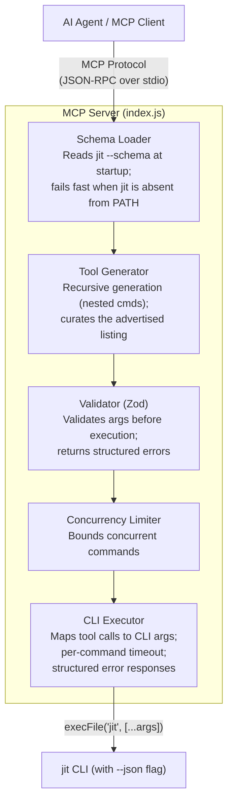

# JIT MCP Server

Model Context Protocol server for the Just-In-Time issue tracker.

## Overview

This MCP server wraps the `jit` CLI to provide MCP tools for AI agents. At startup it loads
the JIT schema and generates tools from its leaf commands.

## Features

- **Schema-generated tools** - every schema leaf command becomes a callable MCP tool
- **Curated default listing** - `tools/list` advertises an agent-facing subset of the generated tools
- **Nested subcommand support** - handles multi-level commands like `doc.assets.list`
- **Type-safe** input validation using Zod
- **Runtime schema loading** - the live schema from `jit --schema` defines the server's startup surface
- **Structured error responses** - consistent JSON envelope with error codes
- **Operational hardening** - timeouts (30s) and concurrency limits (10 concurrent commands)
- **Modular architecture** - clean separation of concerns for maintainability

## Installation

`jit` must already be installed or built and available on `PATH`: the server loads
`jit --schema` before it starts. For a source checkout:

```bash
cargo build --release
export PATH="$(pwd)/target/release:$PATH"
cd mcp-server
npm install
```

## Usage

### As MCP Server

The server communicates over stdio using the Model Context Protocol:

```bash
node index.js
```

### With GitHub Copilot CLI

**Note**: GitHub Copilot CLI and the MCP server both need `jit` on `PATH`.

1. Build the CLI and add to PATH:
   ```bash
   cd /path/to/just-in-time
   cargo build --release
   export PATH="$(pwd)/target/release:$PATH"
   ```

2. Add and verify the local stdio server:
   ```bash
   copilot mcp add jit -- node /path/to/just-in-time/mcp-server/index.js
   copilot mcp list
   ```

   The [GitHub Copilot CLI MCP guide](https://docs.github.com/en/enterprise-cloud@latest/copilot/how-tos/copilot-cli/customize-copilot/add-mcp-servers) documents this workflow and the user configuration file at `~/.copilot/mcp-config.json`.

### MCP Client Configuration Example

Add this server definition to your MCP client's configuration:

```json
{
  "mcpServers": {
    "jit": {
      "command": "node",
      "args": ["/path/to/just-in-time/mcp-server/index.js"]
    }
  }
}
```

## Available Tools

Every leaf command in `jit --schema` becomes a callable tool named `jit_<command_path>`, so
`jit doc assets list` is `jit_doc_assets_list`. Any generated tool can be invoked by name.

`tools/list` advertises a curated subset: the commands an autonomous agent drives to find work,
claim it, inspect it, transition it, check gates, and read repository structure. Interactive
setup, destructive operations, registry administration, and alias spellings stay out of the
listing so the advertised surface stays small enough to reason about.

[`curated-tools.json`](curated-tools.json) is the source of truth for that decision. It records
the curation policy, the ceiling the test suite enforces, and a one-line rationale for every
command it includes or excludes. Adding a CLI command fails `npm test` until the manifest decides
it.

To enumerate the listing, or the full generated set:

```bash
echo '{"jsonrpc":"2.0","id":1,"method":"tools/list"}' | node index.js
printf '%s\n' '{"jsonrpc":"2.0","id":1,"method":"tools/list"}' | JIT_MCP_ALL_TOOLS=1 node index.js
```

## Example Usage (via MCP)

When used with an MCP client:

```
User: Create a high-priority issue for implementing authentication
Agent: [calls jit_issue_create with title="Implement authentication", priority="high"]

User: Show me all ready issues
Agent: [calls jit_query_available]

User: Add a dependency - the auth issue depends on the database setup
Agent: [calls jit_dep_add with from_id="AUTH_ID", to_ids=["DB_ID"]]
```

## Implementation Details

### Architecture

The server is modularized into focused components:

```
mcp-server/
├── index.js                    # MCP server entry point
├── curated-tools.json          # Curation manifest for the default tool listing
└── lib/
    ├── schema-loader.js        # Runtime schema loading from `jit --schema`
    ├── tool-generator.js       # Recursive tool generation
    ├── validator.js            # Zod-based input validation
    ├── cli-executor.js         # CLI execution with timeouts
    └── concurrency.js          # Concurrency limiter
```

### Schema Loading

The CLI is the source of truth for the command schema. The server invokes `jit --schema` once at
startup and fails fast when the binary is absent from `PATH`. Its MCP surface matches that loaded
schema; after rebuilding or replacing `jit`, restart the MCP server to load the changed schema.
The generated `jit_profile_apply`, `jit_project_render`, and `jit_validate` tools therefore expose
the same recoverable publication, managed-region, drift-repair, and actionable JSON error contracts
documented in the CLI's [Repository Profiles reference](../docs/reference/profiles.md); MCP does not
maintain a second transaction or error model.

### Dynamic Tool Generation with Nested Subcommands

The server recursively generates tools from the schema, supporting multi-level nesting:

```javascript
function generateToolsRecursive(commands, parentPath = []) {
  const tools = [];
  
  for (const [cmdName, cmd] of Object.entries(commands)) {
    const currentPath = [...parentPath, cmdName];
    
    if (cmd.subcommands) {
      // Recurse into subcommands
      tools.push(...generateToolsRecursive(cmd.subcommands, currentPath));
    } else {
      // Leaf command - generate tool
      tools.push(generateToolFromCommand(currentPath, cmd));
    }
  }
  
  return tools;
}
```

This correctly handles commands like `doc.assets.list` → `jit_doc_assets_list`.

### Input Validation

Arguments are validated with Zod before CLI execution:

```javascript
// Validate arguments against tool schema
const validation = validateArguments(args, tool.inputSchema);

if (!validation.success) {
  return {
    content: [{
      type: "text",
      text: JSON.stringify({
        success: false,
        error: { code: "VALIDATION_ERROR", message: validation.error }
      })
    }],
    isError: true
  };
}
```

### CLI Execution with Timeouts

Each command execution includes timeout and concurrency controls:

```javascript
// Execute with concurrency limiting and a per-command timeout
const timeout = getTimeoutForCommand(cmdPath);
const result = await concurrencyLimiter.run(async () => {
  return await executeCommand(cmdPath, args, cmdDef, timeout);
});
```

### Tool Result Responses

Successful tool calls return an MCP `CallToolResult`. The default `content`
mode returns one text content block containing a short summary followed by JSON
for the compacted command result. Set `JIT_MCP_RESPONSE_MODE=structured` to
return the summary in `content` and the compacted command result in
`structuredContent`.

Error results set `isError: true`. Handler-generated errors use a text content
block containing JSON with `success: false` and an `error` object (including a
code and message); callers should use `isError` to identify the result as an
error.

## Development

### Updating Tools

Tools are generated at server startup directly from `jit --schema`; no schema file is bundled
with the server. To pick up a new or changed CLI command, rebuild `jit` and make sure the
updated binary is the one on `PATH`, then restart the MCP server.

### Testing

Run the automated test suite:

```bash
# Ensure jit is in PATH first
cd ..
cargo build --release
export PATH="$(pwd)/target/release:$PATH"

# Run tests
cd mcp-server
npm test
```

The test suite verifies:
- MCP protocol initialization
- Tool listing matches the `curated-tools.json` include set and stays under its ceiling
- Every generated tool is decided by the curation manifest, with a rationale
- Nested subcommand tool generation and CLI mapping
- outputSchema resolution against the live CLI schema
- Input validation with Zod (required fields, type checking)
- Structured error responses with proper envelopes
- Concurrency limiter behavior (bounding, queueing, error propagation)
- Tool execution and error handling
- Invalid tool/argument rejection

Test manually with JSON-RPC:

```bash
echo '{"jsonrpc":"2.0","id":1,"method":"tools/list"}' | node index.js
```

Test with isolated directory:

```bash
./test-with-env.sh
```

## Troubleshooting

### "jit: command not found"

The MCP server launches `jit` directly with Node's `execFile`, not through a shell. It inherits
the MCP host process environment, including `PATH`; ensure that environment can find `jit`:

```bash
# Check if jit is accessible
which jit

# If not, add to your shell config (~/.bashrc, ~/.zshrc, etc.)
export PATH="/path/to/just-in-time/target/release:$PATH"

# Then reload
source ~/.bashrc  # or ~/.zshrc
```

Alternatively, hardcode an absolute path in the `execFile('jit', ...)` calls in
`lib/schema-loader.js` and `lib/cli-executor.js`:
```javascript
const { stdout } = await execFileAsync('/absolute/path/to/jit', [...args]);
```

### Module not found

Install dependencies:
```bash
cd mcp-server
npm install
```

### Node version issues

Requires Node.js 20+, matching the CI floor (`.github/workflows/ci.yml`):
```bash
node --version  # Should be v20 or later
```

## Architecture



## Version

At startup the server advertises and logs the version loaded from `jit --schema`; it does not use
the version in `mcp-server/package.json` for that MCP version. Run `jit --version` to inspect the
CLI executable on `PATH` directly.

## License

MIT OR Apache-2.0 (matches parent project)

## See Also

- [JIT CLI Documentation](../README.md)
- [MCP Tools Reference](../docs/reference/cli-commands.md#mcp-tools-reference)
- [CLI and MCP Strategy](../dev/architecture/cli-and-mcp-strategy.md)
- [Model Context Protocol](https://modelcontextprotocol.io/)
