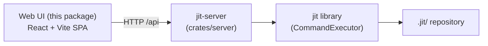

# JIT Web UI

A React, TypeScript, and Vite single-page app for visualizing a JIT issue tracker. It renders the dependency DAG, per-issue detail, linked documents, and label groupings from a JIT repository, reading everything over the HTTP API exposed by `jit-server`.

## How it fits together

The web UI is a static front end. It holds no data of its own: at runtime it calls the JIT REST API under `/api` on its own origin, and the `jit-server` binary (`crates/server/`) serves that API by embedding the core `jit` library in-process, reading the repository's `.jit/` directory directly.



`jit-server` can serve the built assets itself: when the web UI is built and compiled in with the `embed-web` feature, the server serves the SPA at `/` alongside the API at `/api`. It also accepts a `--web-dir` pointing at a `dist/` directory to serve from the filesystem. A live event stream (`/api/events/stream`) drives updates as the repository changes.

## What it renders

- **Graph view** (`src/components/Graph`) lays out the dependency DAG with `reactflow` and `dagre`.
- **Issue view** (`src/components/Issue`) shows issue detail, state, gates, and dependencies.
- **Documents** (`src/components/Document`) render linked markdown with `react-markdown`, GitHub-flavored markdown, Mermaid diagrams, and KaTeX math.
- **Labels** (`src/components/Labels`) and **Search** (`src/components/Search`) navigate issues by label namespace and free text.

## Scripts

Defined in `package.json`:

```bash
npm run dev          # Start the Vite dev server with hot reload
npm run build        # Type-check (tsc -b) and produce a production build in dist/
npm run preview      # Serve the production build locally
npm run lint         # Run ESLint over the sources
npm test             # Run the Vitest unit tests once
npm run test:watch   # Run Vitest in watch mode
```

## Local development

```bash
npm install
npm run dev
```

Run `jit-server` against the repository you want to inspect so the UI has an API to call. For a full walkthrough, including building `dist/` and serving it behind a static file server or `jit-server`, see the [deployment how-to guide](../docs/how-to/deployment.md).

## License

MIT OR Apache-2.0 (matches parent project)
